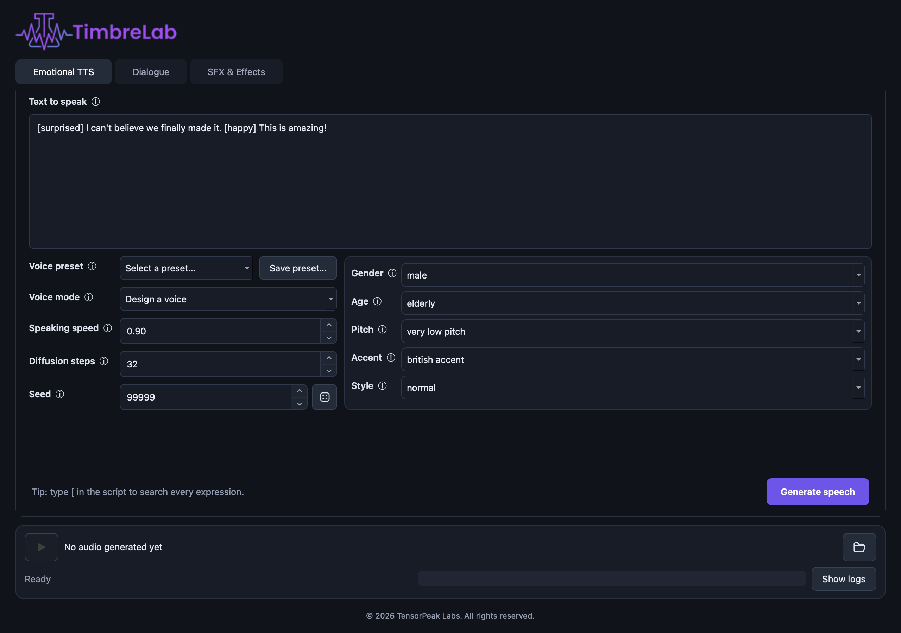

<p align="center">
  
</p>

A local PyQt6 desktop studio for speech, multi-speaker dialogue, and generated
sound effects. It uses two independently loaded AI audio engines:

- **OmniVoice** for multilingual TTS, voice design, and supported expressive tags.
- **AudioLDM Small v2** for prompt-based sound effects and environmental audio.

The engines use separate Python environments because their PyTorch dependency
stacks differ. They run as persistent background processes, keeping the UI
responsive and loading each model only once per session.

## Features

- Emotional and multilingual TTS with inline OmniVoice expression cues
- Voice cloning from a short reference recording, saved as a reusable preset
- Multi-speaker dialogue assembled from saved voice presets
- Prompt-based SFX generation with AudioLDM Small v2
- Searchable expression and speaker autocomplete
- Editable voice presets with reproducible seeds
- Temporary audio previews with explicit download-to-save behavior
- Estimated progress, detailed live logs, and a Stop button during generation
- Automatic environment setup, development hot reload, and safe model shutdown

<p align="center">
  
</p>

## Requirements

- Python 3.10 or 3.11 (3.11 is recommended)
- `ffmpeg`
- Several gigabytes of free disk space for environments and model weights
- A capable GPU, or an Apple Silicon Mac with ample unified memory, is strongly recommended

AudioLDM Small v2 is a 421M-parameter latent diffusion model. It runs through
PyTorch MPS on Apple Silicon and downloads about 1.7 GB of model files.

The `cvssp/audioldm-s-full-v2` checkpoint is published under CC-BY-NC-SA 4.0.
Review that license before using generated assets in commercial work.

## Automatic setup and launch

On macOS or Linux, use the self-bootstrapping launcher:

```bash
chmod +x run.sh scripts/setup.sh
./run.sh
```

It automatically finds Python 3.11 or 3.10, checks all three environments,
installs only missing or incomplete components, and starts the app with the
correct interpreter. Subsequent launches skip setup and start immediately.

To prepare or verify the environments without opening the UI:

```bash
./run.sh --setup-only
```

For development, launch with hot reload:

```bash
./run.sh --dev
```

While this mode is active, changes to application Python files automatically
stop playback and model workers, close the current process, and launch the
updated UI. Closing the window normally stops the development launcher.

## Manual install

On macOS or Linux:

```bash
chmod +x scripts/setup.sh
./scripts/setup.sh
```

If a slow download is interrupted, resume just that environment with
`./scripts/setup.sh omnivoice` or `./scripts/setup.sh sfx`.

To select a different compatible Python executable for either launcher:

```bash
PYTHON_BIN=/path/to/python3.11 ./scripts/setup.sh
```

Or launch with automatic environment checks:

```bash
PYTHON_BIN=/path/to/python3.11 ./run.sh
```

The setup creates three local environments:

| Environment | Purpose |
| --- | --- |
| `.venv` | PyQt desktop application and tests |
| `.venv-omnivoice` | OmniVoice speech generation |
| `.venv-sfx` | AudioLDM sound-effect generation |

## Run

```bash
.venv/bin/python -m audio_playground
```

You can also use the installed console entry point:

```bash
.venv/bin/timbrelab
```

The existing `ai-audio-playground` command and `audio_playground` Python module
remain available for backward compatibility.

The application opens in a resizable 1240×860 window. Hover a field marked with
`ⓘ`, or the field itself, for a concise explanation of its behavior. Maximize it
with the normal window control if you want more room.

The first generation with either engine may download pretrained weights. Live
status, estimated progress, and detailed logs appear in the bottom panel. The
**Stop** button is visible only while work is active.

Generated WAV files are session-scoped temporary previews. Select **Download audio…**
to choose a permanent destination; previews that were not downloaded
are removed when the app closes.

Use **Ctrl+Enter** on Linux/Windows or **Command+Enter** on macOS to generate
from the active tab. The app remembers the selected tab between launches. Logs
open automatically during generation and collapse afterward unless you changed
their visibility manually.

## Emotional TTS controls

OmniVoice supports a defined set of inline expressive cues rather than an arbitrary emotion-strength parameter. The expression dropdown includes friendly aliases (`[happy]`, `[sad]`, `[surprised]`, `[questioning]`, and `[dissatisfied]`) and every native non-verbal cue: `[laughter]`, `[sigh]`, `[confirmation-en]`, `[question-en]`, `[question-ah]`, `[question-oh]`, `[question-ei]`, `[question-yi]`, `[surprise-ah]`, `[surprise-oh]`, `[surprise-wa]`, `[surprise-yo]`, and `[dissatisfaction-hnn]`. Friendly aliases are translated in place to their closest supported cue. Voice design supports gender, age, pitch, accent, and normal or whispering delivery.

Typing `[` in the speech editor opens tag autocomplete. Continue typing to filter
the list, then choose a tag with the arrow keys and Enter or with the mouse. The
partial text is replaced with the complete tag, including its closing bracket.

Voice configurations can be saved under a custom name and reapplied from the
**Voice preset** dropdown. Presets include voice mode, design attributes,
speaking speed, diffusion steps, and seed. Loading a preset restores its seed,
and saving or replacing one stores the currently selected seed.

The main speech defaults are speed `0.90`, 64 diffusion steps, and seed `9999`.
Seed accepts values from `0` through `2,147,483,647`. Reusing the same text,
voice configuration, generation settings, seed, runtime, and hardware gives a
repeatable result. Different hardware or PyTorch versions can still introduce
small numerical differences.

On first launch, the app creates editable starter presets. Each starts with seed
`9999`, which can be changed and saved:

| Preset | Voice configuration |
| --- | --- |
| `male-narrator` | Male, elderly, very low pitch, British accent, normal, speed 0.9, 64 steps |
| `female-narrator` | Female, middle-aged, high pitch, British accent, normal, speed 0.9, 64 steps |
| `warm-female-narrator` | Female, middle-aged, moderate pitch, Canadian accent, normal, speed 0.95, 48 steps |
| `young-male-narrator` | Male, young adult, moderate pitch, American accent, normal, speed 1.0, 48 steps |
| `deep-male-announcer` | Male, middle-aged, very low pitch, American accent, normal, speed 0.85, 64 steps |
| `soft-female-whisper` | Female, young adult, low pitch, British accent, whispering, speed 0.85, 48 steps |
| `elderly-female-storyteller` | Female, elderly, low pitch, British accent, normal, speed 0.9, 64 steps |
| `energetic-female-host` | Female, young adult, high pitch, American accent, normal, speed 1.1, 48 steps |

Existing presets with these names are preserved. Starter presets are installed
only once and cannot be deleted: **Delete** is hidden while one of them is
selected. They stay editable, so saving over a starter name keeps your version. Presets created with the
previous default seed are migrated once from `42` to `9999`; other custom seeds
remain unchanged.

## Voice cloning

Set **Voice mode** to **Clone a voice** in the Emotional TTS tab, choose a
reference recording, and type its transcript into **Reference text**. A clean 5
to 20 second clip of a single speaker works best, and the transcript has to match
what is actually said — accuracy matters more than length.

Cloned voices are saved like any other preset. Saving one copies its reference
recording into `voices/` (override with `AUDIO_PLAYGROUND_VOICE_DIR`) under the
preset name, so the preset keeps working after the original file moves. Cloned
presets can be assigned to speakers in the **Dialogue** tab exactly like designed
voices.

If a preset's stored recording is later deleted, generation reports the missing
reference instead of falling back to a different voice; re-select the audio and
save the preset again.

## Multi-speaker dialogue

Open **Dialogue**, configure at least two speakers, and assign each one a voice
preset saved from **Emotional TTS**. Write one spoken turn per line using this format:

```text
Arthur: [sigh] I wasn't expecting you.
Maya: [question-en] Should I leave?
Arthur: No, please stay.
```

The tab starts with an editable example: Emma uses `female-narrator`, John uses
`male-narrator`, and a short four-line conversation is ready to generate.

Speaker names are matched case-insensitively and must correspond to the names in
the speaker table. Pressing Enter for a new line opens speaker autocomplete;
continue typing to filter the configured names, then choose one to insert
`Speaker: `. Expression-tag autocomplete is also available in the dialogue
editor. The app renders every line with its assigned preset, inserts a short pause
between turns, and combines the result into one temporary audio preview.

Dialogue requires at least two configured speakers. Its editable seed defaults
to `9999` and controls one deterministic random sequence across all rendered
turns.

## Sound-effect controls

Open **SFX & Effects**, describe the sound, and select **Generate sound effect**.
AudioLDM accepts descriptive prompts such as:

> A cinematic thunder crack followed by heavy rain on a metal rooftop,
> realistic, no music

- **Duration** defaults to 5 seconds and supports generated clips from 1 to 30 seconds.
- **Prompt guidance** controls how strongly the result follows the description.
  The default of 2.5 is a useful starting point; high values may reduce variety.
- **Diffusion steps** range from 8 to 256 and default to 128. More steps may add
  detail but increase rendering time.
- **Seed** controls AudioLDM's starting noise. The same seed, prompt, duration,
  guidance, and steps reproduce the same effect on the same runtime and hardware.
  It defaults to `9999` and remains editable.

The first SFX request downloads approximately 1.7 GB of AudioLDM weights. The
worker then stays loaded for later requests during the same app session. The log
panel reports download activity, model-loading heartbeats, and diffusion-step
progress. **Stop** is shown only while a worker is active.

## Configuration

Worker interpreters and the output directory can be overridden:

```bash
OMNIVOICE_PYTHON=/path/to/python \
SFX_PYTHON=/path/to/python \
AUDIO_PLAYGROUND_OUTPUT_DIR=/path/to/outputs \
.venv/bin/python -m audio_playground
```

## Tests

```bash
.venv/bin/python -m pytest -q
```

The automated suite covers expression normalization, safe output naming,
dialogue parsing, voice-preset persistence and migration, deterministic seed
wiring, device selection, download progress helpers, and hot-reload discovery.
Full model generation remains a manual integration check because it requires
multi-gigabyte downloads and suitable hardware.

## Common issues

- **Worker environment not found:** run `./scripts/setup.sh` from the project directory.
- **Out of memory:** close other GPU-heavy applications, shorten SFX duration, then restart the app to unload and reload workers.
- **AudioLDM on Apple Silicon:** the worker uses PyTorch MPS with float32 precision and attention slicing. Float16 is intentionally limited to CUDA because it can produce silent AudioLDM waveforms on MPS.
- **Slow first generation:** both workers download weights on first use and cache them through Hugging Face.
- **Download remains at `0/N`:** the outer Hugging Face counter only advances after a complete model blob finishes. The live log reports cached bytes and transfer activity instead. The app disables the Xet downloader so interrupted downloads resume through standard HTTP. Supplying an optional `HF_TOKEN` environment variable may improve Hugging Face rate limits.
- **AudioLDM appears idle:** the live log emits timed heartbeats for imports, model preparation, diffusion-step percentages, and WAV writing. A download with no cache growth for two minutes is explicitly labeled as a possible stall.
- **The app used to crash on close:** current shutdown logic stops playback and both worker processes before Qt destroys the window. If this still occurs, include the terminal output when reporting it.
